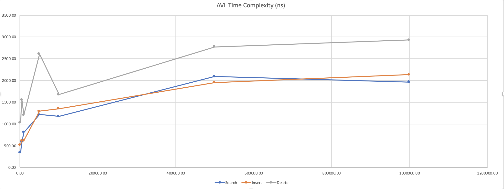

# HSA data structures and algorithms

<h3>Balanced BST<h3/>

AVL tree implementation: ``com.course.hsa.bst.AVLTree``

Collected time measurements for basic operations (search, insert, delete) on datasets with different size 

Conclusions: 
- measurements demonstrate the time complexity as O(log(n)) for basic operations

<h3>Counting Sort<h3/>

Counting Sort implementation: ``com.course.hsa.sort.CountingSort``

Counting sort is good for sorting well-defined, finite, and tiny numbers.

Advantages:
- Fast: Count sort can run very fast depending on the range of items to be sorted.
- Constant memory usage: Counting sort uses memory equal to the number of elements to be sorted.
- Simple: Count sort is relatively simple and easy to understand compared to other sorting algorithms.

Disadvantages:
- Limited to small input ranges. Can be inefficient in terms of memory usage if the input data consists of elements that are much larger than the input size.
- Incompatible with decimal values.